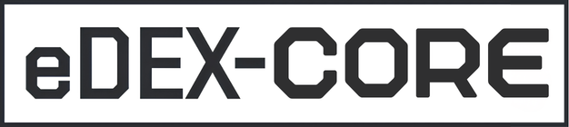

<p align="center">
  <br>
  
  <br><br>
  <strong>eDEX</strong>
  <br><br>
</p>

**eDEX** is a sci-fi terminal workspace — terminal, code editor, and browser unified in a single fullscreen interface. Built for developers who want a distraction-free, keyboard-driven environment without context switching.

---

## What it is

- A **fullscreen terminal workspace** with TRON-inspired aesthetics
- An **all-in-one dev environment** — terminal, editor (VS Code via code-server), and browser in one shell
- **Lightweight by design** — compact dashboard, minimal chrome, maximum room for work
- **Cross-platform** — Linux, macOS, and Windows via Electron

## Features

- Fully featured terminal emulator with tabs, colors, mouse events, and `curses` support
- Embedded VS Code editor (code-server) — full extensions, debugging, terminal
- Embedded browser tabs — navigate docs, GitHub, dashboards without leaving eDEX
- Real-time system and network monitoring in a compact dashboard
- On-screen keyboard and touch display support
- Directory viewer that follows the terminal's working directory
- Themes, keyboard layouts, and CSS customization
- Optional sound effects

## Run from source

```bash
npm install
npm start
```

Requires Node.js 18+.

### Editor tab (VS Code)
Install code-server for the editor tab:
```bash
curl -fsSL https://code-server.dev/install.sh | sh
```

## Keyboard Shortcuts

| Shortcut | Action |
|----------|--------|
| `Ctrl+Shift+B` | New browser tab |
| `Ctrl+Shift+E` | New editor tab |
| `Ctrl+Shift+W` | Close current tab |
| `Ctrl+Tab` / `Ctrl+Shift+Tab` | Next/Previous terminal tab |
| `Ctrl+Shift+S` | Settings |
| `Ctrl+Shift+K` | Shortcuts help |

## Credits

Forked and extended from [eDEX-UI](https://github.com/GitSquared/edex-ui) by Gabriel 'Squared' SAILLARD.

Licensed under the [GPLv3.0](LICENSE).